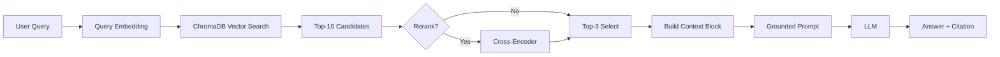

# Architecture — RAG Pipeline (Day 08 Lab)

> Template: Điền vào các mục này khi hoàn thành từng sprint.
> Deliverable của Documentation Owner.

## 1. Tổng quan kiến trúc

```
[Raw Docs]
    ↓
[index.py: Preprocess → Chunk → Embed → Store]
    ↓
[ChromaDB Vector Store]
    ↓
[rag_answer.py: Query → Retrieve → Rerank → Generate]
    ↓
[Grounded Answer + Citation]
```

**Mô tả ngắn gọn:**
> Hệ thống là một trợ lý RAG nội bộ cho khối CS + IT Helpdesk, dùng để trả lời các câu hỏi về SLA, hoàn tiền, cấp quyền và FAQ bằng chứng cứ từ tài liệu chính sách nội bộ. Pipeline gồm index tài liệu, truy xuất theo nhiều chiến lược, tạo câu trả lời grounded có citation, rồi đánh giá bằng scorecard.

---

## 2. Indexing Pipeline (Sprint 1)

### Tài liệu được index
| File | Nguồn | Department | Số chunk |
|------|-------|-----------|---------|
| `policy_refund_v4.txt` | policy/refund-v4.pdf | CS | 6 |
| `sla_p1_2026.txt` | support/sla-p1-2026.pdf | IT | 5 |
| `access_control_sop.txt` | it/access-control-sop.md | IT Security | 8 |
| `it_helpdesk_faq.txt` | support/helpdesk-faq.md | IT | 6 |
| `hr_leave_policy.txt` | hr/leave-policy-2026.pdf | HR | 5 |

### Quyết định chunking
| Tham số | Giá trị | Lý do |
|---------|---------|-------|
| Chunk size | 400 tokens (ước lượng) | Cân bằng giữa giữ ngữ cảnh và không làm context block quá dài |
| Overlap | 80 tokens | Giảm mất mạch giữa các đoạn và giữ câu điều khoản liên tiếp |
| Chunking strategy | Heading-based + paragraph-based | Ưu tiên ranh giới tự nhiên, chỉ cắt cứng khi section quá dài |
| Metadata fields | source, section, effective_date, department, access | Phục vụ filter, freshness, citation |

### Embedding model
- **Model**: `Alibaba-NLP/gte-multilingual-base`
- **Vector store**: ChromaDB (PersistentClient)
- **Similarity metric**: Cosine

---

## 3. Retrieval Pipeline (Sprint 2 + 3)

### Baseline (Sprint 2)
| Tham số | Giá trị |
|---------|---------|
| Strategy | Dense (embedding similarity) |
| Top-k search | 10 |
| Top-k select | 3 |
| Rerank | Không |

### Variant (Sprint 3)
| Tham số | Giá trị | Thay đổi so với baseline |
|---------|---------|------------------------|
| Strategy | Hybrid / Rerank / Query transform | Tách biến để A/B riêng biệt |
| Top-k search | 10 | Giữ nguyên để so sánh công bằng |
| Top-k select | 3 | Giữ số chunk đưa vào prompt nhỏ để tiết kiệm token |
| Rerank | `cross-encoder/ms-marco-MiniLM-L-6-v2` | Chọn biến này vì dễ so sánh với dense baseline |
| Query transform | Local expansion + optional LLM rewrite | Chọn phương án rẻ token nhất để tăng recall cho alias/query cũ |

**Lý do chọn variant này:**
> Nhóm chọn hybrid làm biến gốc vì corpus có cả câu tự nhiên (policy) lẫn tên riêng/mã lỗi (SLA ticket P1, ERR-403). Sau đó tách riêng rerank và query transform để A/B được từng biến. Trong đánh giá nội bộ, hybrid không khác baseline quá nhiều vì dense baseline đã đạt recall rất cao trên test nhỏ, còn rerank/query transform chỉ cải thiện nhẹ ở một vài câu khó nhưng đổi lại tăng latency.

---

## 4. Generation (Sprint 2)

### Grounded Prompt Template
```
Answer only from the retrieved context below.
If the context is insufficient, say you do not know.
Cite the source field when possible.
Keep your answer short, clear, and factual.

Question: {query}

Context:
[1] {source} | {section} | score={score}
{chunk_text}

[2] ...

Answer:
```

### LLM Configuration
| Tham số | Giá trị |
|---------|---------|
| Model | Groq `llama-3.1-8b-instant` với fallback OpenAI `gpt-4o-mini` |
| Temperature | 0 (để output ổn định cho eval) |
| Max tokens | 512 |

---

## 5. Failure Mode Checklist

> Dùng khi debug — kiểm tra lần lượt: index → retrieval → generation

| Failure Mode | Triệu chứng | Cách kiểm tra |
|-------------|-------------|---------------|
| Index lỗi | Retrieve về docs cũ / sai version | `inspect_metadata_coverage()` trong index.py |
| Chunking tệ | Chunk cắt giữa điều khoản | `list_chunks()` và đọc text preview |
| Retrieval lỗi | Không tìm được expected source | `score_context_recall()` trong eval.py |
| Generation lỗi | Answer không grounded / bịa | `score_faithfulness()` trong eval.py |
| Token overload | Context quá dài → lost in the middle | Kiểm tra độ dài context_block |

---

## 7. Sprint 4 — Evaluation Summary

**Test set:** 10 questions trong `data/test_questions.json`

### Baseline vs Variants

| Metric | Baseline | Variant (hybrid) | Delta |
|---|---:|---:|---:|
| Faithfulness | 3.90 | 3.80 | -0.10 |
| Relevance | 4.60 | 4.60 | +0.00 |
| Context Recall | 5.00 | 5.00 | +0.00 |
| Completeness | 3.20 | 2.80 | -0.40 |
| Latency (avg ms) | 3805 | 4191 | +387 |
| % Questions Answered | 100.0% | 100.0% | +0.0% |

| Metric | Baseline | Rerank | Query Transform |
|---|---:|---:|---:|
| Faithfulness | 3.90 | 4.20 | 4.00 |
| Relevance | 4.60 | 4.50 | 4.60 |
| Context Recall | 5.00 | 5.00 | 5.00 |
| Completeness | 3.20 | 3.70 | 3.20 |
| Latency (avg ms) | 3805 | 5903 | 6885 |
| % Questions Answered | 100.0% | 100.0% | 100.0% |

### Retrieval comparison summary

| Strategy | Recall@3 | Top1 | MRR | Avg prompt tokens |
|---|---:|---:|---:|---:|
| Baseline dense | 100.0% | 88.9% | 0.94 | 322 |
| Hybrid RRF | 100.0% | 88.9% | 0.94 | 321 |
| Rerank dense | 100.0% | 88.9% | 0.94 | 339 |
| Query transform dense | 100.0% | 77.8% | 0.89 | 335 |

### Kết luận

- Hybrid không cách baseline quá xa vì baseline dense đã đạt context recall 5/5 trên toàn bộ test set; khác biệt chủ yếu nằm ở cách sắp xếp và mức grounding của câu trả lời.
- Rerank cải thiện faithfulness/completeness tốt nhất trong 3 biến nhưng làm latency tăng rõ rệt.
- Query transform giúp một số câu alias nhưng không nhất quán trên test nhỏ, và latency cao nhất.
- Vì vậy nhóm chọn **hybrid** làm biến mặc định cho Sprint 3; rerank và query transform được giữ như biến thử nghiệm riêng để A/B.

---

## 6. Diagram

> Sơ đồ Mermaid bên dưới mô tả luồng pipeline end-to-end của nhóm.


