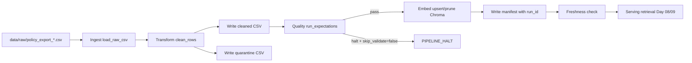

# Kiến trúc pipeline — Lab Day 10

**Nhóm:** Team Day10  
**Cập nhật:** 2026-04-15

---

## 1. Sơ đồ luồng (bắt buộc có 1 diagram: Mermaid / ASCII)

> Vẽ thêm: điểm đo **freshness**, chỗ ghi **run_id**, và file **quarantine**.

---

## 2. Ranh giới trách nhiệm

| Thành phần | Input | Output | Owner nhóm |
|------------|-------|--------|--------------|
| Ingest | `data/raw/policy_export_*.csv` | `rows` trong memory + log `raw_records` | Ingestion Owner |
| Transform | Raw rows | `artifacts/cleaned/cleaned_<run_id>.csv`, `artifacts/quarantine/quarantine_<run_id>.csv` | Cleaning Owner |
| Quality | Cleaned rows | expectation results + quyết định halt/continue | Quality Owner |
| Embed | Cleaned CSV | Chroma collection `day10_kb` (upsert theo `chunk_id`) | Embed Owner |
| Monitor | Manifest + timestamp | trạng thái freshness PASS/WARN/FAIL + chi tiết SLA | Monitoring Owner |

---

## 3. Idempotency & rerun

> Mô tả: upsert theo `chunk_id` hay strategy khác? Rerun 2 lần có duplicate vector không?

Pipeline dùng `chunk_id` ổn định sau clean và gọi `col.upsert(...)`, nên rerun không tạo duplicate vector cho cùng `chunk_id`. Ngoài ra có bước prune (`col.delete(ids=drop)`) để xóa các id không còn trong cleaned snapshot, tránh vector cũ còn sót gây nhiễu retrieval top-k. Vì vậy publish boundary của index được giữ nhất quán theo từng `run_id`.

---

## 4. Liên hệ Day 09

> Pipeline này cung cấp / làm mới corpus cho retrieval trong `day09/lab` như thế nào? (cùng `data/docs/` hay export riêng?)

Day 10 đóng vai trò lớp dữ liệu phía trước retrieval của Day 09: thay vì embed trực tiếp dữ liệu chưa kiểm soát, pipeline sẽ ingest-clean-validate rồi mới publish vào Chroma. Day 09 agent truy vấn cùng collection `day10_kb` nên chất lượng trả lời phụ thuộc trực tiếp vào trạng thái pipeline (rule clean, expectation, freshness). Cách này giúp giảm lỗi “answer đúng bề mặt nhưng context stale”.

---

## 5. Rủi ro đã biết

- Source export stale vượt SLA vẫn có thể được embed nếu nhóm không chặn ở bước vận hành.
- Rule hiện dựa nhiều vào pattern tĩnh; khi nguồn đổi schema có thể phát sinh false negative.
- Chưa có auto-alert và dashboard nên việc phát hiện sự cố còn phụ thuộc người vận hành đọc log.
- Việc quản lý collection theo môi trường (dev/staging/prod) chưa tách biệt hoàn toàn.
