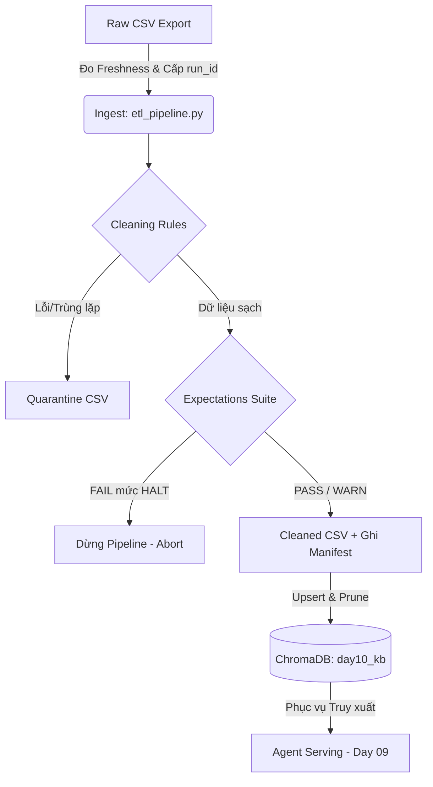

**Nhóm:** [Điền Tên/Số Nhóm của bạn]  
**Cập nhật:** 15/04/2026

---

## 1. Sơ đồ luồng (bắt buộc có 1 diagram: Mermaid / ASCII)



---

## 2. Ranh giới trách nhiệm

| Thành phần | Input | Output | Owner nhóm |
|------------|-------|--------|--------------|
| Ingest | Tệp `policy_export_dirty.csv` | Log `raw_records`, biến `run_id` | Ingestion Owner (Thành viên 2) |
| Transform | Dữ liệu raw đã nạp | `cleaned_csv`, `quarantine_csv` | Cleaning Owner (Thành viên 3) |
| Quality | Dữ liệu `cleaned_csv` | Log Expectation (PASS / WARN / HALT) | Quality Owner (Thành viên 4) |
| Embed | Dữ liệu `cleaned_csv` | Vector index trong collection `day10_kb` | Đan Kha (Embed Owner) |
| Monitor | Toàn bộ pipeline artifact | File `manifest.json`, kết quả `freshness_check` | Monitor/Docs Owner (Thành viên 5) |

---

## 3. Idempotency & rerun

Chiến lược embed của hệ thống tuân thủ nghiêm ngặt tính idempotent để tránh hiện tượng phình to vector database (vector bloat):
* **Upsert theo `chunk_id`:** Sử dụng phương thức `.upsert()` của ChromaDB thay vì `.add()`. Nếu chạy lại pipeline, các `chunk_id` đã tồn tại sẽ được ghi đè/cập nhật thông tin mới nhất chứ không sinh ra bản sao (duplicate vector).
* **Cắt tỉa (Pruning) tàn dư cũ:** Khi chạy pipeline, hệ thống sẽ quét tập hợp các ID hiện có trong collection và so sánh với danh sách `chunk_id` mới từ file CSV sạch (`prev_ids - set(ids)`). Những ID cũ không còn tồn tại trong snapshot mới nhất sẽ bị chủ động xóa đi (`col.delete(ids=drop)`). 
* **Kết luận:** Chạy lại (rerun) pipeline 2 lần hay 100 lần với cùng một đầu vào sẽ cho ra chính xác cùng một kết quả trong database, không sinh ra bất kỳ vector trùng lặp nào.

---

## 4. Liên hệ Day 09

Pipeline này đóng vai trò là "nhà máy xử lý và cung cấp nguyên liệu" cho hệ thống Agent (CS + IT Helpdesk) được xây dựng từ Day 09. 
Thay vì để Agent trực tiếp đọc tài liệu thô chứa nhiều phiên bản mâu thuẫn (như việc lẫn lộn chính sách hoàn tiền 14 ngày cũ và 7 ngày mới), hệ thống Agent Day 09 giờ đây sẽ kết nối thẳng vào collection `day10_kb` của ChromaDB. Nhờ vậy, Agent chỉ truy xuất từ một corpus đã được làm sạch, kiểm định chặt chẽ (validated), và đảm bảo độ tươi mới (freshness).

---

## 5. Rủi ro đã biết

- **Lỗi phụ thuộc kiến trúc Schema:** Nếu hệ thống thượng nguồn xuất file CSV thay đổi hoàn toàn tên cột (schema drift) mà không báo trước, hàm Transform sẽ bị lỗi `KeyError`.
- **Giới hạn lưu trữ cục bộ:** ChromaDB hiện đang chạy dưới dạng Persistent Client lưu trữ qua file local (`./chroma_db`). Trong môi trường làm việc nhóm mà có nhiều pipeline chạy ghi (write) đồng thời, có rủi ro xảy ra hiện tượng khóa tệp (file-locking) trên Windows.
- **Cảnh báo thư viện Model:** Khởi tạo `all-MiniLM-L6-v2` cục bộ sẽ văng log cảnh báo `embeddings.position_ids | UNEXPECTED`. Đây là hành vi an toàn của thư viện, không ảnh hưởng đến độ chính xác của vector nhưng làm log pipeline bị nhiễu.
```


