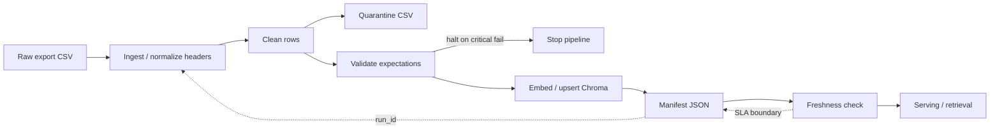

# Kiến trúc pipeline — Lab Day 10

**Nhóm:** AICB-P1 Group 113  
**Cập nhật:** 2026-04-15

---

## 1. Sơ đồ luồng (bắt buộc có 1 diagram: Mermaid / ASCII)

**Điểm đo chính**:
- `run_id` xuất hiện trong log, cleaned/quarantine filename và manifest.
- `quarantine` là đường ra tách riêng, không publish.
- `freshness` đọc từ manifest sau publish.

---

## 2. Ranh giới trách nhiệm

| Thành phần | Input | Output | Owner nhóm |
|------------|-------|--------|--------------|
| Ingest | `data/raw/policy_export_dirty.csv` | rows đã strip/sanitize header | Ingestion / Raw Owner |
| Transform | raw rows | cleaned rows + quarantine rows | Cleaning & Quality Owner |
| Quality | cleaned rows | expectation results + halt flag | Cleaning & Quality Owner |
| Embed | cleaned CSV | Chroma collection `day10_kb` | Embed & Idempotency Owner |
| Monitor | manifest JSON | PASS/WARN/FAIL freshness | Monitoring / Docs Owner |

---

## 3. Idempotency & rerun

Pipeline dùng `chunk_id` làm khóa idempotent cho Chroma `upsert`.

- `chunk_id` được hash ổn định từ `doc_id + normalized chunk_text`, không phụ thuộc thứ tự dòng.
- Rerun với cùng cleaned content không tạo duplicate vector.
- Trước khi upsert, pipeline prune các `chunk_id` không còn tồn tại trong cleaned snapshot hiện tại.
- Điều này tránh “vector mồi cũ” làm retrieval lệch sau publish boundary.
- Log xác nhận: `embed_upsert count=6` và `embed_prune_removed=1` ở lần rerun final.

---

## 4. Liên hệ Day 09

Pipeline này refresh corpus cho Day 09 bằng cách publish snapshot sạch vào collection riêng `day10_kb`.

- Cùng nội dung policy/helpdesk với Day 09 nhưng đi qua lớp clean/validate trước khi embed.
- Day 09 đọc retrieval context từ Chroma; Day 10 đảm bảo context đó không còn chunk stale.
- Tách collection riêng để tránh ghi đè nhầm corpus đang dùng cho demo khác.

---

## 5. Rủi ro đã biết

- Freshness fail nếu `exported_at` của snapshot raw đã cũ hơn SLA.
- Nếu bật `--no-refund-fix`, expectation `refund_no_stale_14d_window` sẽ trở thành gate hữu ích cho demo inject.
- Nếu `cleaning_rules.py` đổi allowlist/doc_id mà contract không đồng bộ, quarantine sẽ tăng đột biến.
